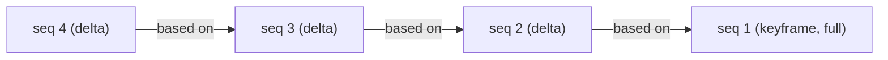

# How storage works

pg-xpatch stores versioned rows as a chain: one full snapshot followed by the differences that lead from one version to the next. This page is the model behind that, enough to reason about compression, read cost, and the trade-offs you tune later.

## Groups and order

Two columns define the structure. `group_by` splits the table into independent chains, one per value (one per document, user, or file). `order_by` is the version order inside a chain.

To track position, pg-xpatch adds an internal `_xp_seq` column: a counter that starts at 1 for each group and increments per insert. It is allocated per group, so writes to different groups never coordinate. That is also why the chains are independent: a new version of document A never touches document B.

## Keyframes and deltas

The first row in a group is stored in full. That is a **keyframe**. Every row after it is stored as a **delta**: only the bytes that differ from an earlier version.

A chain of pure deltas would grow without limit, and rebuilding the latest version would mean replaying the entire history. So pg-xpatch drops a fresh keyframe every `keyframe_every` rows (default 100). Each keyframe starts a new sub-chain, which caps how far back any single read has to walk.

!!! note "What a delta points at"
    Each delta carries a small `tag`: the number of rows back to its base. `tag = 1` means the row right before it, `tag = 2` two rows back, and so on. A keyframe is the special case that needs no base at all. You can see these with [`xpatch.inspect()`](./monitoring.md).

## Choosing a delta

When `compress_depth` is greater than 1, a new row is encoded against several previous rows at once, not just the immediate predecessor. pg-xpatch keeps whichever delta comes out smallest and records its `tag`. Higher `compress_depth` finds better matches at the cost of more work per insert. [Tuning compression](./tuning-compression.md) covers how to set it.

On top of that, if `enable_zstd` is on (the default), the delta bytes get a second squeeze with Zstandard before they hit disk.

## Reconstruction

Reading a row reverses the process. Given a delta at `seq`, pg-xpatch finds its base at `seq - tag`, rebuilds that base (recursively, until it reaches a keyframe), then applies the delta. A keyframe rebuilds directly, since it holds the full content. Both the encode and reconstruct paths live in [`xpatch_storage.c`](../src/xpatch_storage.c).

!!! info "Why keyframes matter for reads"
    The work to rebuild a row is bounded by the distance back to its keyframe, never the full history. With `keyframe_every = 100`, the worst case is replaying 99 deltas. Reconstructed bases are also memoized in the [shared cache](./caching-and-performance.md), so when many versions share an ancestor, that ancestor is decoded once and reused.

## Why this shape

The model buys two things:

- **Bounded reads.** Keyframes keep any single reconstruction short and stop a damaged delta from poisoning more than its own sub-chain.
- **Parallel writes.** Because chains are per group, two clients editing two different documents write concurrently. Ordering only matters *within* a single group.

The cost is the flip side: a write does encoding work, and a cold full-table scan has to rebuild everything. Both are covered in [Caching & performance](./caching-and-performance.md).

!!! cards { cols=2 }
    - [Caching & performance](./caching-and-performance.md){ icon=zap }
      How reconstruction stays fast, and why the cache is essential.

    - [Tuning compression](./tuning-compression.md){ icon=minimize-2 }
      Set `keyframe_every`, `compress_depth`, and `enable_zstd`.
